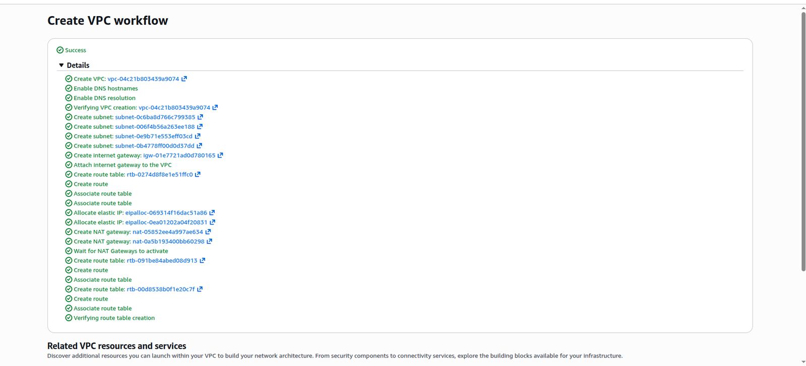
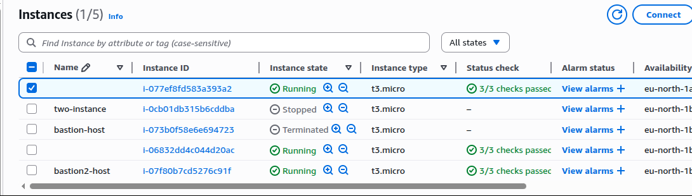
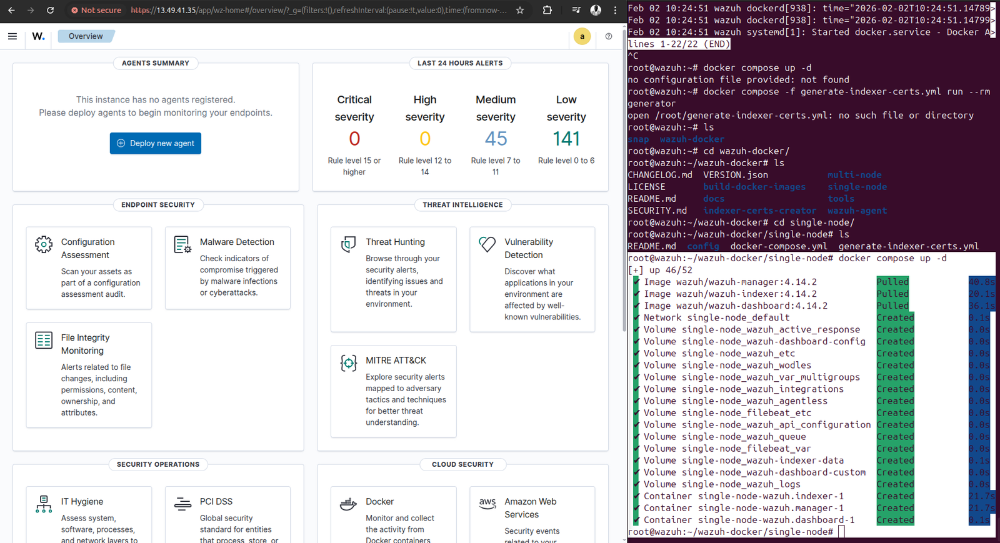
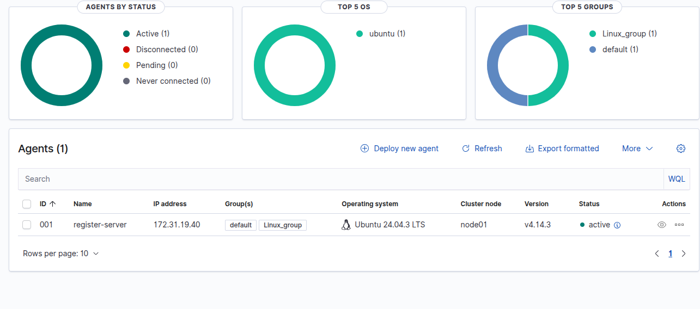
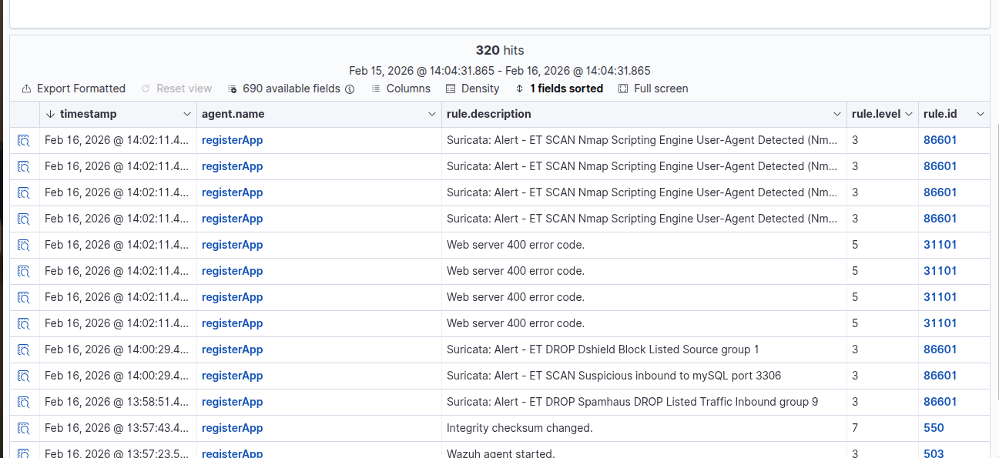
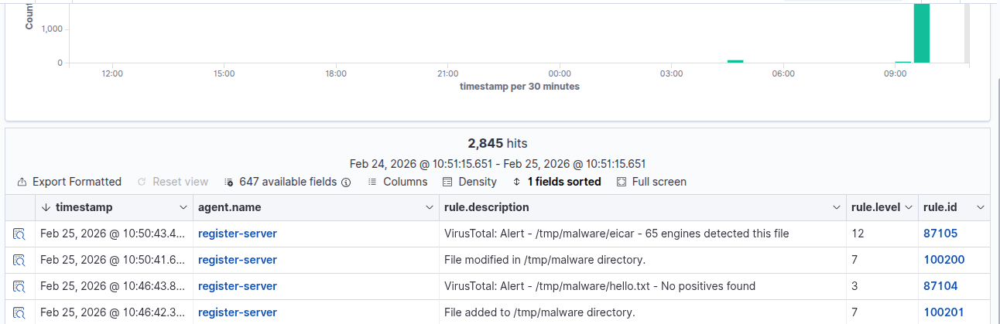
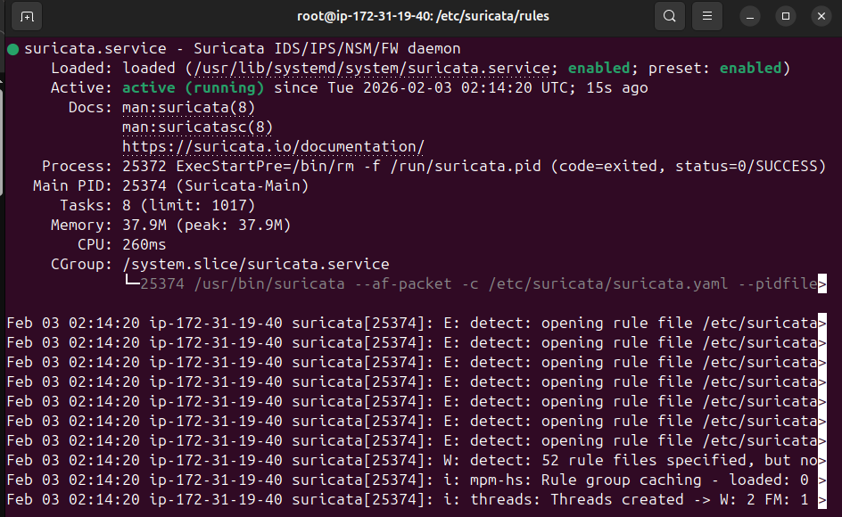

# Wazuh SIEM Security Lab

A hands-on cybersecurity lab demonstrating Wazuh SIEM deployment, endpoint monitoring, vulnerability visibility, Suricata IDS alerts, VirusTotal enrichment, file integrity monitoring, and AWS cloud networking.

## Project Overview

This project documents a Wazuh-based SIEM lab built to practice security monitoring and incident visibility in a cloud environment. The lab involved deploying Wazuh, configuring a monitored endpoint, reviewing alerts, integrating network detection with Suricata, using VirusTotal enrichment, and observing file integrity events.

## Objectives

- Deploy a Wazuh SIEM lab environment
- Configure cloud networking using AWS VPC resources
- Prepare compute resources for the Wazuh server and monitored endpoint
- Monitor endpoint activity through a connected Wazuh agent
- Review vulnerability detection results
- Analyze Suricata IDS alerts in Wazuh Threat Hunting
- Observe VirusTotal and file integrity monitoring alerts
- Practice log analysis, alert investigation, and security event visibility

## Technologies Used

- Wazuh SIEM
- Suricata IDS
- VirusTotal
- AWS EC2
- AWS VPC
- AWS Security Groups
- Docker / Docker Compose
- Linux / Ubuntu
- SSH
- Log analysis
- File Integrity Monitoring
- Vulnerability Detection

## Lab Evidence

### 1. AWS VPC Workflow

Created the AWS VPC resources used for the lab networking environment, including subnets, route tables, internet gateway, NAT gateway, DNS hostnames, and DNS resolution.

### 2. EC2 Instances Overview

Prepared EC2 instances for the lab environment, including instances used for the Wazuh server and supporting endpoint/testing hosts.

### 3. Wazuh Deployment Dashboard

Deployed Wazuh using Docker Compose and accessed the Wazuh dashboard to confirm the platform was running.

### 4. Wazuh Agent Connected

Connected a monitored Ubuntu endpoint to Wazuh and confirmed the agent was active.

### 5. Vulnerability Detection Dashboard

Reviewed vulnerability detection results from the monitored endpoint, including severity counts, affected packages, and operating system visibility.

### 6. Suricata Threat Hunting Alerts

Integrated Suricata IDS alerts into Wazuh and reviewed network security events in Threat Hunting.

### 7. VirusTotal and File Integrity Alerts

Generated file activity in a monitored directory and reviewed Wazuh alerts showing VirusTotal detection and file integrity monitoring events.

### 8. Suricata Service Running

Confirmed Suricata service status and rule loading on the monitoring host.

## Detection Scenarios Demonstrated

### Brute-Force and Authentication Monitoring

Observed authentication-related security visibility through Wazuh logs and alert monitoring.

### Suspicious Activity and Threat Hunting

Used Wazuh Threat Hunting to review security events, suspicious activity, rule descriptions, and alert severity.

### Vulnerability Visibility

Used Wazuh vulnerability detection to identify affected packages, severity levels, operating system exposure, and pending evaluations.

### File Integrity Monitoring

Monitored file activity in selected directories and reviewed alerts for added, modified, and changed files.

### Suricata IDS Monitoring

Integrated Suricata alerts into Wazuh to provide network-based intrusion detection visibility.

### VirusTotal Enrichment

Used VirusTotal integration to enrich file-related security alerts and identify potentially malicious test files.

## Key Skills Demonstrated

- Wazuh SIEM deployment and dashboard usage
- Endpoint agent enrollment and monitoring
- Linux system administration
- AWS VPC and EC2 lab setup
- Docker-based security tool deployment
- Security alert review and investigation
- Vulnerability detection and risk visibility
- Suricata IDS integration
- VirusTotal enrichment
- File integrity monitoring
- Log analysis and threat hunting
- Secure lab documentation

## Security Note

Screenshots were selected and cropped to avoid exposing unnecessary browser, account, and sensitive cloud details. Before publishing any additional screenshots, review and remove public IPs, account IDs, passwords, keys, tokens, and sensitive firewall/security group rules.

## Author

**Lubega Isaac Patrick**  
GitHub: https://github.com/lippatrick  
LinkedIn: https://www.linkedin.com/in/isaac-lubega-cybersecurity-analyst/
