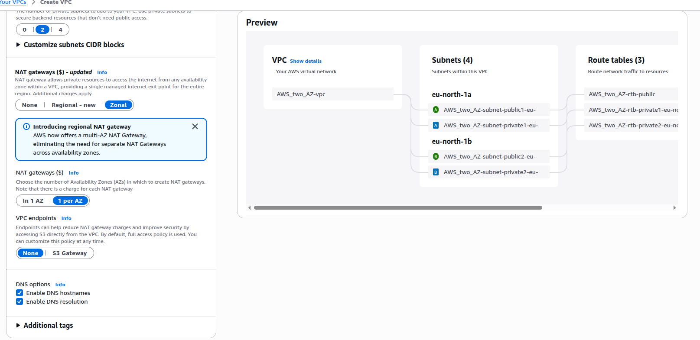

# Wazuh SIEM Security Lab

A practical cybersecurity lab documenting cloud-based SIEM deployment, endpoint monitoring, security visibility, and detection workflow practice using Wazuh, Suricata, VirusTotal, Linux, and AWS.

## Project Overview

This project demonstrates a Wazuh SIEM security lab built to practice endpoint monitoring, log analysis, alert investigation, file integrity monitoring, vulnerability visibility, intrusion detection, and secure cloud infrastructure setup.

The lab was designed to strengthen practical cybersecurity, systems administration, cloud networking, and incident detection skills.

## Objectives

- Deploy a Wazuh SIEM lab in a cloud environment
- Configure a monitored endpoint/agent
- Practice endpoint monitoring and log analysis
- Review authentication and security alerts
- Demonstrate file integrity monitoring
- Integrate or document Suricata IDS for network visibility
- Integrate or document VirusTotal for threat intelligence
- Practice secure AWS network planning and access control
- Improve incident detection and investigation workflow

## Technologies Used

- Wazuh SIEM
- Suricata IDS
- VirusTotal
- AWS EC2
- AWS VPC
- AWS Security Groups
- Linux/Ubuntu
- SSH
- Log analysis
- File Integrity Monitoring
- Vulnerability Detection

## Lab Architecture

The lab was designed on AWS using a dedicated VPC with subnet planning, routing, DNS support, and controlled access. A Wazuh server was deployed on an EC2 instance, and a monitored endpoint was connected as an agent for security event collection and analysis.

Security Groups were used to control network access, while Wazuh provided endpoint visibility, alerting, log analysis, and security monitoring.

## Key Skills Demonstrated

- SIEM deployment and configuration
- Endpoint monitoring
- Log collection and analysis
- Security alert investigation
- File integrity monitoring
- Vulnerability visibility
- Network security visibility using Suricata
- Threat intelligence workflow using VirusTotal
- AWS VPC and subnet planning
- Linux systems administration
- Secure cloud-based lab deployment
- Documentation of cybersecurity lab work

## Screenshots

### AWS VPC and Network Setup

> More screenshots can be added as the lab documentation grows, especially Wazuh dashboard, connected agent, alerts, Suricata events, and VirusTotal results.

## Detection Scenarios Tested

### 1. Brute-Force Attack Detection

Simulated repeated failed login attempts to generate authentication-related alerts.

**Skills demonstrated:**
- Authentication log monitoring
- Brute-force detection
- Alert investigation
- Security event analysis

### 2. Suspicious Command Detection

Observed endpoint activity and reviewed how suspicious commands or unusual behavior can appear in system logs and security alerts.

**Skills demonstrated:**
- Endpoint visibility
- Command monitoring
- Log analysis
- Suspicious activity identification

### 3. File Integrity Monitoring

Monitored selected files and directories to detect unauthorized or unexpected changes.

**Skills demonstrated:**
- File integrity monitoring
- Change detection
- Endpoint security monitoring
- Alert review

### 4. Vulnerability Visibility

Reviewed vulnerability-related findings from the monitored endpoint.

**Skills demonstrated:**
- Vulnerability identification
- Risk visibility
- Endpoint security assessment

### 5. Network Intrusion Detection

Used Suricata IDS concepts to support detection of suspicious network activity.

**Skills demonstrated:**
- IDS monitoring
- Network security visibility
- Security alert correlation

## Lessons Learned

This lab improved my understanding of how SIEM tools collect, analyze, and present security events. It also strengthened my practical knowledge in AWS networking, endpoint monitoring, Linux administration, log analysis, threat visibility, and incident detection workflows.

## Future Improvements

- Add Wazuh dashboard screenshots
- Add connected agent screenshots
- Add alert screenshots for brute-force and suspicious activity
- Add Suricata alert screenshots
- Add VirusTotal integration screenshots
- Add dashboard reporting
- Configure email notifications
- Add more monitored endpoints
- Improve detection rule documentation

## Author

**Lubega Isaac Patrick**  
Cybersecurity & Network Support Specialist  
GitHub: https://github.com/lippatrick  
LinkedIn: https://www.linkedin.com/in/isaac-lubega-cybersecurity-analyst/
