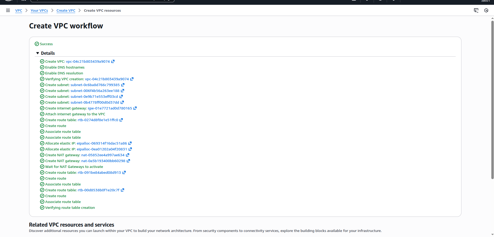
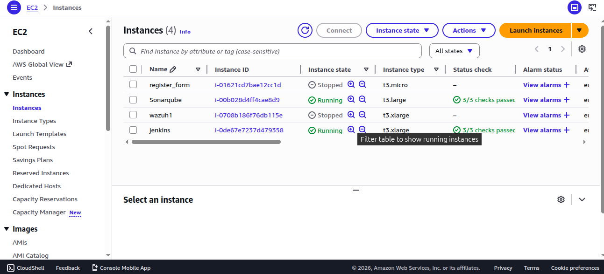
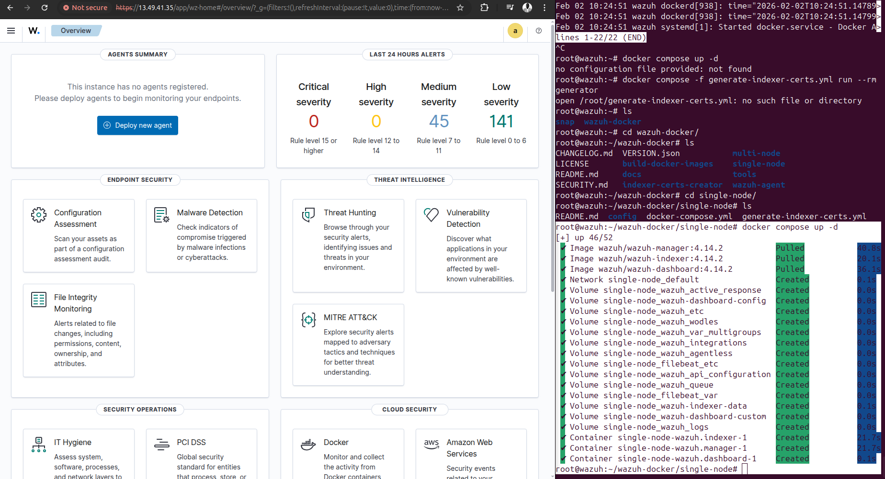
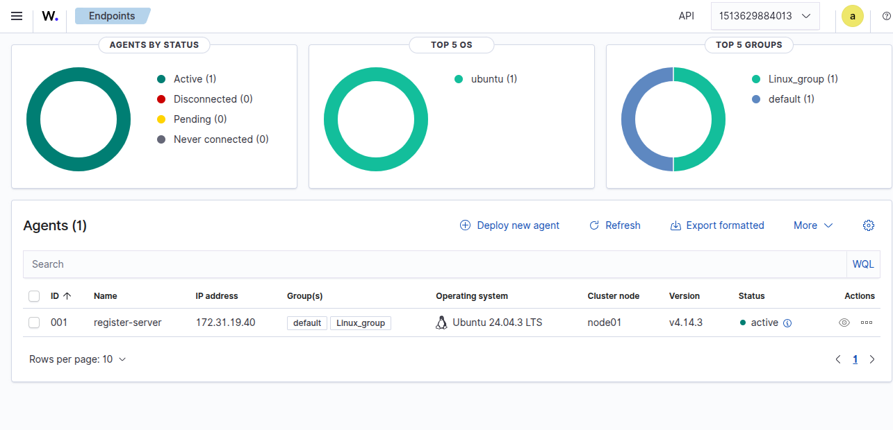
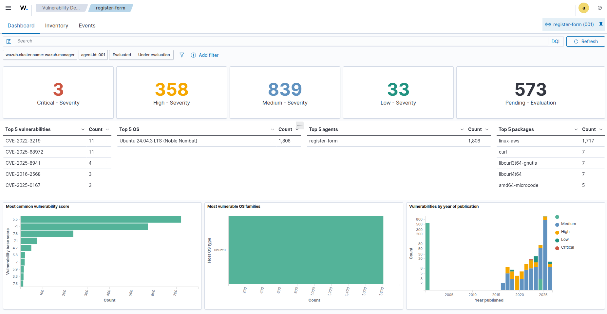
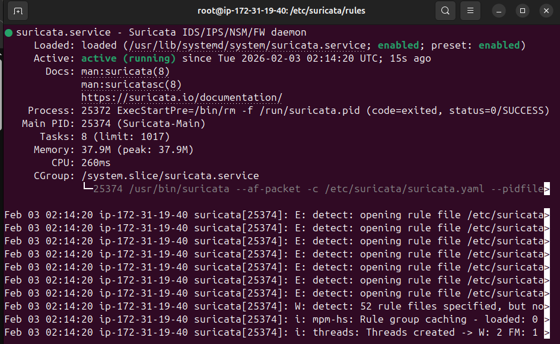
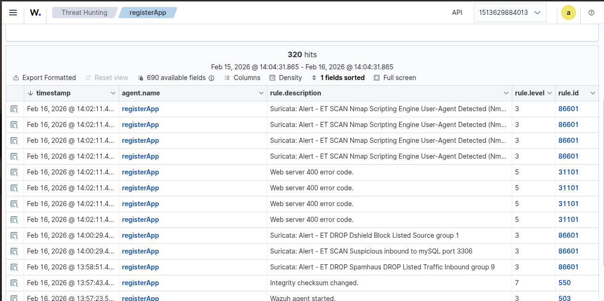
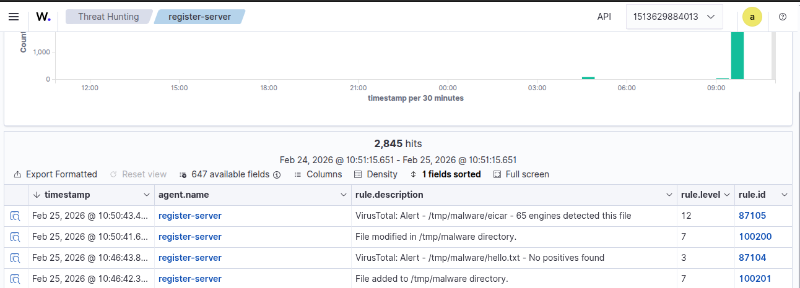
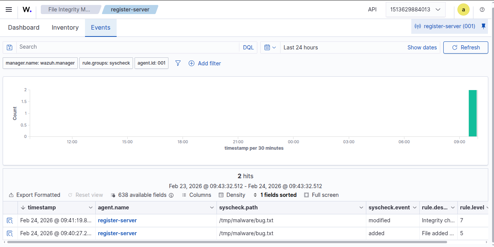
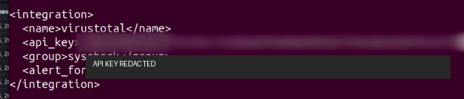

# Wazuh SIEM Security Lab

A hands-on cybersecurity lab showing how I deployed and tested a Wazuh SIEM environment for endpoint monitoring, vulnerability visibility, Suricata IDS alerting, VirusTotal enrichment, File Integrity Monitoring, and AWS cloud networking.

## Project Overview

This project documents a practical Wazuh SIEM lab built in a cloud environment. The lab was used to practice security monitoring, endpoint visibility, network intrusion detection, vulnerability review, log analysis, threat intelligence enrichment, and alert investigation.

The setup includes AWS cloud infrastructure, a Wazuh deployment, an Ubuntu endpoint agent, Suricata IDS, VirusTotal integration, and controlled File Integrity Monitoring tests.

## Objectives

- Build a cloud-based cybersecurity monitoring lab
- Deploy Wazuh SIEM and access the Wazuh dashboard
- Configure a monitored Linux endpoint using the Wazuh agent
- Use Wazuh for endpoint visibility, log review, and alert investigation
- Review vulnerability detection results from the monitored endpoint
- Integrate Suricata IDS alerts into Wazuh Threat Hunting
- Test File Integrity Monitoring using controlled file changes
- Use VirusTotal enrichment to inspect suspicious file activity
- Document the lab as a professional cybersecurity portfolio project

## Technologies Used

- Wazuh SIEM
- Suricata IDS
- VirusTotal
- AWS EC2
- AWS VPC
- AWS Security Groups
- Docker and Docker Compose
- Linux / Ubuntu
- SSH
- File Integrity Monitoring
- Vulnerability Detection
- Log Analysis
- Threat Hunting

## Lab Architecture

The lab was hosted on AWS. The AWS environment provided networking and compute resources for the Wazuh server and monitored endpoint. Wazuh collected endpoint data from the Ubuntu agent and displayed alerts, vulnerabilities, and file integrity events through the dashboard.

Suricata was configured to generate network security alerts, which were reviewed from Wazuh Threat Hunting. VirusTotal enrichment was configured to provide additional context for suspicious file activity.

```text
AWS VPC
├── EC2 Instance: Wazuh Server
│   ├── Wazuh Manager
│   ├── Wazuh Dashboard
│   └── Wazuh Indexer
│
├── EC2 Instance: Ubuntu Monitored Endpoint
│   └── Wazuh Agent
│
├── Suricata IDS
│   └── Network alert generation
│
└── VirusTotal Integration
    └── File reputation enrichment
```

## Lab Evidence

### 1. AWS VPC Resources Created

Successful AWS VPC resource creation for the lab networking foundation.



**What it demonstrates:**

- AWS VPC planning
- Cloud networking
- Subnet and routing preparation
- Security lab infrastructure foundation

### 2. AWS EC2 Lab Instances

EC2 instances used for the Wazuh server and supporting monitored/test hosts.



**What it demonstrates:**

- Cloud compute setup
- Instance management
- Lab environment organization
- Security monitoring infrastructure

### 3. Wazuh Docker Deployment

Wazuh single-node deployment using Docker with dashboard access confirmed.



**What it demonstrates:**

- Docker-based Wazuh deployment
- Linux server administration
- Security platform setup
- Dashboard availability verification

### 4. Wazuh Agent Connected

Ubuntu monitored endpoint connected successfully to Wazuh.



**What it demonstrates:**

- Endpoint onboarding
- Wazuh agent enrollment
- Agent health verification
- Endpoint visibility

### 5. Vulnerability Detection Dashboard

Wazuh vulnerability detection results showing severity distribution and affected packages.



**What it demonstrates:**

- Vulnerability visibility
- Risk review
- Package assessment
- Security dashboard analysis

### 6. Suricata IDS Service Running

Suricata IDS enabled and running on the monitoring host.



**What it demonstrates:**

- Suricata setup
- Linux service management
- IDS rule loading
- Network security monitoring preparation

### 7. Suricata Alerts in Wazuh Threat Hunting

Suricata-generated alerts visible in Wazuh Threat Hunting.



**What it demonstrates:**

- Suricata and Wazuh integration
- Threat hunting workflow
- Network alert review
- Rule severity interpretation

### 8. VirusTotal and File Integrity Alerts

VirusTotal enrichment and FIM events generated from controlled file activity.



**What it demonstrates:**

- VirusTotal enrichment
- File integrity monitoring
- Suspicious file alerting
- Alert investigation

### 9. File Integrity Monitoring Events

FIM events showing added and modified monitored files.



**What it demonstrates:**

- File Integrity Monitoring
- Change detection
- Syscheck event review
- Monitored path verification

### 10. VirusTotal Integration Configuration

VirusTotal integration configuration with sensitive API key redacted.



**What it demonstrates:**

- Threat intelligence integration
- Wazuh integration configuration
- Sensitive data redaction
- Secure project documentation

## Detection Scenarios Demonstrated

### Endpoint Agent Monitoring

A Linux endpoint was connected to Wazuh using the Wazuh agent. The endpoint became visible in the dashboard with active status, operating system details, agent group, and agent version.

### Vulnerability Detection

Wazuh was used to review vulnerability findings on the monitored endpoint. The dashboard displayed severity levels, vulnerable packages, and affected operating system information.

### Suricata IDS Alerting

Suricata IDS was configured and used to generate network security alerts. These alerts were reviewed inside Wazuh Threat Hunting to analyze rule descriptions, severity levels, and event timestamps.

### File Integrity Monitoring

Controlled file activity was performed in a monitored directory. Wazuh detected file additions and modifications, showing how FIM can be used to monitor important paths.

### VirusTotal Enrichment

VirusTotal integration was configured to enrich file-related alerts and support investigation of suspicious file activity.

## Key Skills Demonstrated

- Wazuh SIEM deployment
- Docker-based security tool setup
- Linux system administration
- AWS VPC and EC2 setup
- Endpoint monitoring
- Wazuh agent enrollment
- Vulnerability detection
- Log analysis
- Threat hunting
- Suricata IDS integration
- VirusTotal enrichment
- File Integrity Monitoring
- Alert investigation
- Cloud security lab documentation

## Security Note

Screenshots used in this project were selected to show the technical workflow while avoiding unnecessary sensitive exposure. Sensitive values such as API keys should never be committed to GitHub. The VirusTotal configuration screenshot has been redacted.

## Author

**Lubega Isaac Patrick**

- GitHub: [lippatrick](https://github.com/lippatrick)
- LinkedIn: [Isaac Lubega Cybersecurity Analyst](https://www.linkedin.com/in/isaac-lubega-cybersecurity-analyst/)
